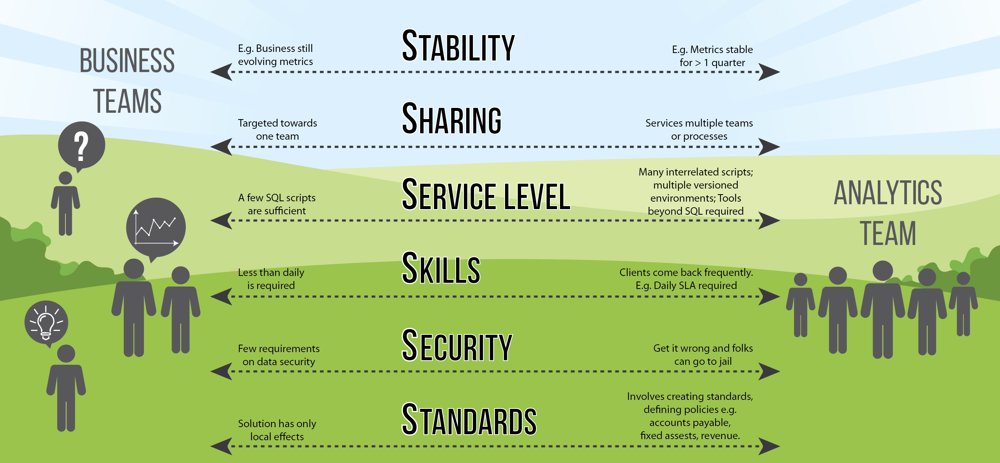

The viewpoints in the following post are my own and not meant to represent an official stance from Google.

6 Ss: when to centralize your data efforts

Engineering / IT team ⟷ Central Data Team ⟷ End Business Users

When scaling an analytics program you quickly run across the question of where a process/dashboard/function should live. A similar question is asked when it comes to insourcing vs outsourcing. You insource for quality. You outsource for price. To you help make this decision I propose asking addressing six questions (conveniently and easy memorization, they all start with S).

## Size
Is the size of the work enough to warrant passing it to a central team? Often this arises from analysts wanting to toss over an individual process or spreadsheet to the central team to run. Central teams need to add frameworks, incorporate many discrete processes into their systems. Each time a new process is onboarded its expensive.

## Stability
Are requirements stable? Does it still require more experimentation? If you are updating it more often than quarterly then keep it on the periphery until it stabilizes. 

## Sharing
How many different teams are targeted as clients? A value of a central team is making connections is owning the few central tools that can be shared across multiple clients.

## Service Level
What service level agreement or objective do you have? Does it require high levels of data accuracy? What about uptime? Or freshness? Typically central teams are better able to support higher service levels.

## Skills
How difficult is the solution to create?

## Security
Risk associated with data

## Standards
Does the solution create standards or define policies? A good rule is if you are trying to share data across three or more teams then its a ‘standard’ may fit better on a central team.
